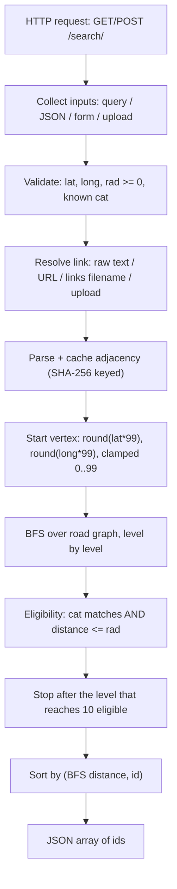

# Proximity Search API — CS559 Lab 7

Given a query point, a category, a radius, and a file describing roads between
locations, the service returns up to **10 location IDs** of the requested
category lying within the radius, ranked by **road (graph) distance** from the
nearest grid point to the query. Roads come only from the link file; missing
roads stay missing.

**Live API:** `<DEPLOYED_URL>` — e.g. `https://<your-app>.onrender.com/docs`

- Interactive docs: `/docs` (Swagger UI) and `/redoc`; raw schema: `/openapi.json`
- Search route: `GET`/`POST /search/` (alias `/search`)
- Parameters: `lat`, `long`, `cat`, `rad`, `link`
- Response: a JSON array of integer location IDs (with an `X-Link-Hash` header)

---

## 1. Dataset facts

`locations.csv` (10,000 rows; columns `ID,Latitude,Longitude,Category`):

- A full **100×100 grid**; every coordinate is `k/99` for `k = 0..99`.
- `id = row*100 + col + 1`, where `row = round(lat*99)` and `col = round(long*99)`.
- **8 categories**, 1,250 locations each: `bank`, `cafe`, `hospital`, `park`,
  `pharmacy`, `restaurant`, `school`, `store`.
- Coordinates are planar; `rad` is a Euclidean distance in the same units.

The link file (see `links/`) lists roads as `a b` ID pairs; it is supplied per
request and is not stored in the CSV.

---

## 2. Architecture



Modules in `app/`:

| Module | Responsibility |
| --- | --- |
| `config.py` | Grid constants (`GRID_N=100`, `GRID_DIV=99`) and env configuration (`CSV_PATH`, `LINKS_DIR`, `RESULT_LIMIT`, `LINK_CACHE_SIZE`, `LINK_FETCH_TIMEOUT`). |
| `data_store.py` | Loads `locations.csv` **once** at startup into ID-indexed lists (`lats`, `longs`, `cat_idx`, `present`) plus a per-category index; `from_rows()` builds small datasets for tests. |
| `link_parser.py` | Resolves the `link` payload (upload bytes / URL / filename in `LINKS_DIR` / raw text), parses it into an undirected adjacency list, maps 4-number lines to grid IDs, and caches parsed graphs by SHA-256. Also provides `nearest_grid_id()`. |
| `search.py` | The BFS proximity search (`proximity_search`) with the category + radius filter, early stop, and ranking. |
| `main.py` | FastAPI app: input collection/validation, the `GET`/`POST` search routes, `/health`, `/`, and the OpenAPI declarations. |

---

## 3. Workflow and algorithm

1. **Start vertex** — nearest grid point to the query: `row = round(lat*99)`,
   `col = round(long*99)`, each clamped to `0..99`; `id = row*100 + col + 1`.
2. **BFS** — explore the road graph from the start vertex level by level
   (distance = number of road edges). Non-existent IDs (gaps in the CSV) are
   never visited or returned.
3. **Eligibility** — a visited node counts only if it matches the category
   **and** `(lat_node-lat)² + (long_node-long)² <= rad²` (the raw query point is
   the circle centre; the boundary is inclusive).
4. **Early stop** — stop after the level at which the cumulative eligible count
   reaches `limit` (10). Because ranking is by BFS distance (a deeper level is
   always worse), stopping early cannot change the result.
5. **Rank and tie-break** — sort eligible nodes by `(BFS distance, id)` ascending
   and return the first 10. Unreachable locations are excluded.

---

## 4. API contract

**Routes:** `GET /search/` and `POST /search/` — also registered without the
trailing slash (`/search`) as an alias.

| Field | Type | Required | Notes |
| --- | --- | --- | --- |
| `lat` | float | yes | Query latitude. Alias: `latitude`. |
| `long` | float | yes | Query longitude. Aliases: `lon`, `lng`, `longitude`. |
| `cat` | string | yes | One of the 8 categories in `locations.csv`. Alias: `category`. |
| `rad` | float | yes | Euclidean radius, `>= 0`. Alias: `radius`. |
| `link` | string / file | no | Roads (see below). Aliases: `links`, `roads`, `file`. |

**Input methods:** query string (GET/POST), a JSON object body, an
`application/x-www-form-urlencoded` form, or a `multipart/form-data` upload.

**`link` forms:** raw text (`a b` per line), an `http(s)` URL, a bare filename
inside `links/`, or a multipart file upload. Commas are accepted as separators;
blank lines and `#` comments are ignored; a 4-number line
(`lat1 long1 lat2 long2`) is treated as a road between the two nearest grid
points.

**Response:** `200` with a JSON array of up to 10 integer IDs, plus an
`X-Link-Hash` header (SHA-256 of the parsed link).

**Errors:** `400` for missing/non-numeric `lat`/`long`/`rad`, negative `rad`,
unknown `cat`, malformed JSON body, or a named link file that does not exist;
`503` while the service is still starting up.

### curl examples

```bash
# GET with a server-side filename (links/grid.txt)
curl -G http://localhost:8000/search/ \
  --data-urlencode "lat=0.5" --data-urlencode "long=0.5" \
  --data-urlencode "cat=bank" --data-urlencode "rad=0.05" \
  --data-urlencode "link=grid.txt"

# GET with a raw text payload (multi-line)
curl -G http://localhost:8000/search/ \
  --data-urlencode "lat=0.5" --data-urlencode "long=0.5" \
  --data-urlencode "cat=bank" --data-urlencode "rad=0.05" \
  --data-urlencode "$(printf 'link=1 2\n2 3\n3 4')"

# POST JSON body
curl -X POST http://localhost:8000/search/ \
  -H 'content-type: application/json' \
  -d '{"lat":0.5,"long":0.5,"cat":"bank","rad":0.05,"link":"1 2\n2 3"}'

# POST form fields
curl -X POST http://localhost:8000/search/ \
  -d 'lat=0.5&long=0.5&cat=bank&rad=0.05&link=1+2'

# POST multipart file upload
curl -X POST http://localhost:8000/search/ \
  -F "lat=0.5" -F "long=0.5" -F "cat=bank" -F "rad=0.05" \
  -F "link=@links/grid.txt"
```

---

## 5. Assumptions and ambiguity choices

| Ambiguity | Choice made | Alternatives accepted |
| --- | --- | --- |
| Link format | `a b` ID pairs, undirected | comma separators; `#` comments/blank lines; 4-number coordinate lines |
| Response shape | bare JSON array of IDs | — |
| Tie order | smaller ID first | final sort is `(BFS distance, id)`, so input order is irrelevant |
| Start point in results? | yes, if it matches category and radius | — |
| Radius boundary | inclusive (`distance <= rad`) | — |
| Grid rounding | Python `round` (round-half-to-even) on `coord*99` | — |
| Out-of-range `lat`/`long` | clamped to the grid (not rejected) | — |
| Category matching | case-sensitive, must be in the CSV | — |
| Missing server-side filename | `400` error | raw-text fallback only for values containing a separator/space |
| No `link` at all | empty graph → only the start vertex can be reachable | — |
| ID gaps in the CSV | a link ID not in the CSV is non-existent: never returned, never traversed | — |

---

## 6. Complexity and measured runtimes

Let `N` = locations, `E` = links, `V` = component size reached by BFS.

| Operation | Time | Space |
| --- | --- | --- |
| Startup CSV load | `O(N)` | `O(N)` |
| Link parse (cache miss) | `O(E log d)` (sorting neighbour lists) | `O(N + E)` |
| Link resolve (cache hit) | `O(payload bytes)` for the SHA-256 | `O(1)` new |
| Query BFS | `O(V + E)` worst case; `O(reached)` with early stop | `O(N)` visited + result |

Representative run of `python3 scripts/benchmark.py` (full 100×100 grid graph,
19,800 undirected edges, 300 random queries, single process, CPython 3.12):

| Stage | Result |
| --- | --- |
| CSV load (10,000 rows) | 13.8 ms (one-off) |
| Parse 19,800 edges (cache miss) | 26.1 ms |
| Cache hit (re-parse skipped) | 0.111 ms |
| Query ≥10 found (early stop), n=135 | mean 0.024 ms, p95 0.039 ms, max 0.055 ms |
| Query <10 found (full component), n=165 | mean 2.234 ms, p95 3.074 ms, max 3.477 ms |
| Overall | p95 2.975 ms, max 3.477 ms |

(Dense queries stop within a few BFS levels; sparse queries exhaust the
connected component, which is the ~2 ms worst case.)

---

## 7. Testing

```bash
pip install -r requirements-dev.txt
python3 -m pytest -q      # 53 passed
```

Coverage:

- **Search** (`tests/test_search.py`): tiny hand-verified graph, disconnected
  components, inclusive radius boundary, tie-breaking by smaller ID, category
  filter + level stop, an exhaustive-BFS cross-check, unknown category, and
  links that reference nonexistent IDs (ID gaps).
- **Link parsing** (`tests/test_link_parser.py`): ID pairs, commas/comments/blank
  lines, coordinate-line fallback, out-of-range IDs and self-loops dropped,
  malformed lines skipped, filename lookup, missing filename → error, URL
  failure → error, and the SHA-256 cache.
- **API** (`tests/test_api.py`): GET query string, POST JSON, POST form, POST
  multipart upload, server-side filename, alias equivalence, validation errors
  (400), invalid JSON, `/health`, `/`, `/docs`, and the OpenAPI schema
  (declared query parameters with required/optional flags, the three request-body
  content types, the array-of-integers `200` response with `X-Link-Hash`, and
  documented `400`/`503`).

---

## 8. Run locally

```bash
python3 -m venv .venv && source .venv/bin/activate
pip install -r requirements.txt
uvicorn app.main:app --reload --port 8000
```

Then open <http://localhost:8000/docs>, or call the API with the curl examples
in §4.

## 9. Run with Docker

```bash
docker build -t proximity-api .
docker run -p 8000:8000 -v "$(pwd)/links:/app/links" proximity-api
```

The optional volume mount exposes `links/grid.txt` so `link=grid.txt` resolves
inside the container. The image listens on `0.0.0.0:8000` (overridable with the
`PORT` environment variable).

---

## 10. Deployment notes

- **Render / Railway (Docker):** point the service at this repo; it uses the
  `Dockerfile`. The platform sets `PORT`, which the container command honours.
- **Procfile (Heroku-style):**
  `web: uvicorn app.main:app --host 0.0.0.0 --port $PORT`.
- Either way the API serves `/search/`, `/health`, `/docs` and `/openapi.json`.
  Replace `<DEPLOYED_URL>` at the top with the resulting URL.

---

## 11. Limitations

- The adjacency cache is per-process and in memory; multiple workers do not
  share it.
- A URL `link` is fetched synchronously inside the request handler, so a slow
  URL can briefly block the event loop.
- Server-side filename lookup is restricted to a bare token inside `LINKS_DIR`
  (no `/` or `\`) to prevent path traversal; nested paths are treated as raw
  text.
- Grid snapping uses round-half-to-even; a query landing exactly on `k + 0.5`
  could snap differently than a half-up rule.
- `lat`/`long` outside `0..1` are clamped rather than rejected.

---

## 12. Project structure

```
Lab7_CSD/
├── app/
│   ├── __init__.py
│   ├── config.py
│   ├── data_store.py
│   ├── link_parser.py
│   ├── main.py
│   └── search.py
├── links/
│   ├── grid.txt
│   └── sample.txt
├── scripts/
│   ├── __init__.py
│   ├── benchmark.py
│   └── make_grid_links.py
├── tests/
│   ├── test_api.py
│   ├── test_link_parser.py
│   └── test_search.py
├── conftest.py
├── Dockerfile
├── .dockerignore
├── .gitignore
├── Lab7_Proximity_Search_Report.tex   # your LaTeX report (kept)
├── locations.csv
├── Procfile
├── README.md
├── requirements.txt
└── requirements-dev.txt
```
